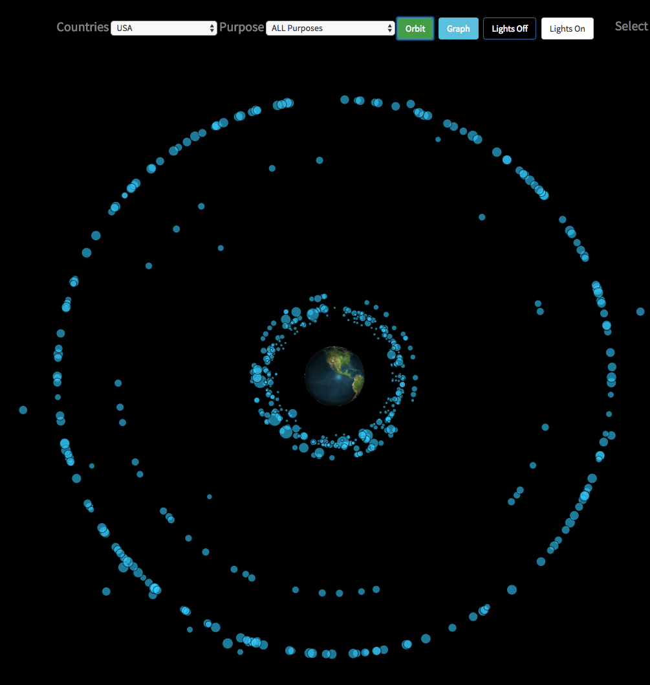

# SpaceJunk - The satellites in our skies



#### _**By Ken Rutan**_, _**Nicky Santamaria**_, _**Dominic Brown**_

## Description

A small app demonstrating the use of D3.js to visualize satellite data.

Union of Concerned Scientists [Satellite Database](http://www.ucsusa.org/nuclear-weapons/space-weapons/satellite-database#.WUgEwBMrLgE)

* [Live Site](http://www.spacejunk.dombrown.net/)

## Technologies used / Prerequisites

* Angular2
* AngularFire
* [Git](https://git-scm.com/)
* [Node.js](https://nodejs.org/) (with NPM)
* [AngularCLI](https://cli.angular.io/) version 1.1.1 (`$ npm install -g @angular/cli`)
* [Firebase](https://firebase.google.com/)
* [d3 ng2](https://github.com/tomwanzek/d3-ng2-service) (`npm install d3-ng2-service --save`)

## Installation

#### upgrade node (Mac with brew)
* `$ brew update`
* `$ brew upgrade node`

#### upgrade node (PC)
* `$ npm -g install npm`

#### Install cont.

* `$ git clone https://github.com/umitosan/space-junk`
* `$ cd space-junk`
* `$ npm install`
* `$ npm start`
* `open a browser at http://localhost:49998`

## Firebase Integration

* Create a firebase account at `https://firebase.google.com`
* Add a new project to your firebase account.
* Update the rules to allow read and write to be true.
* Create a file in the projects app folder labeled api-keys.ts
* Add the following to your api-keys file which you will receive when you click on the button "Add Firebase to your web app" within your firebase project:

```
export var masterFirebaseConfig = {
    apiKey: "xxxx",
    authDomain: "xxxx.firebaseapp.com",
    databaseURL: "https://xxxx.firebaseio.com",
    storageBucket: "xxxx.appspot.com",
    messagingSenderId: "xxxx"
  };
```

## License

*This software is licensed under MIT license.*

```
Copyright (c) 2017 **Ken Rutan**, **Nicky Santamaria**, **Dominic Brown**
```
